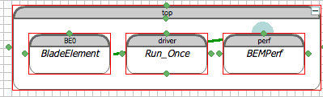
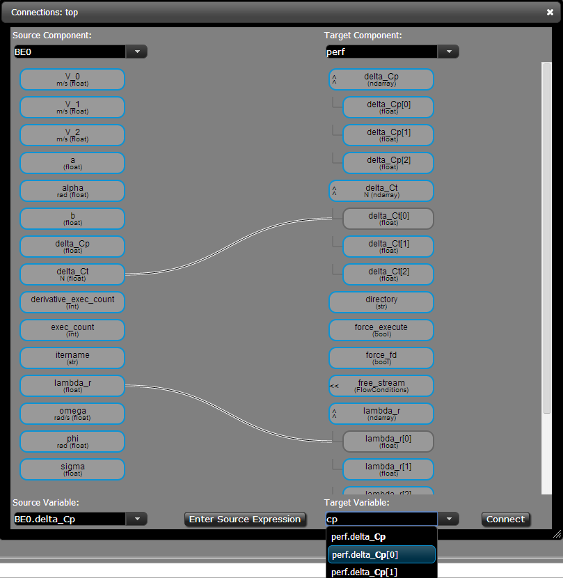
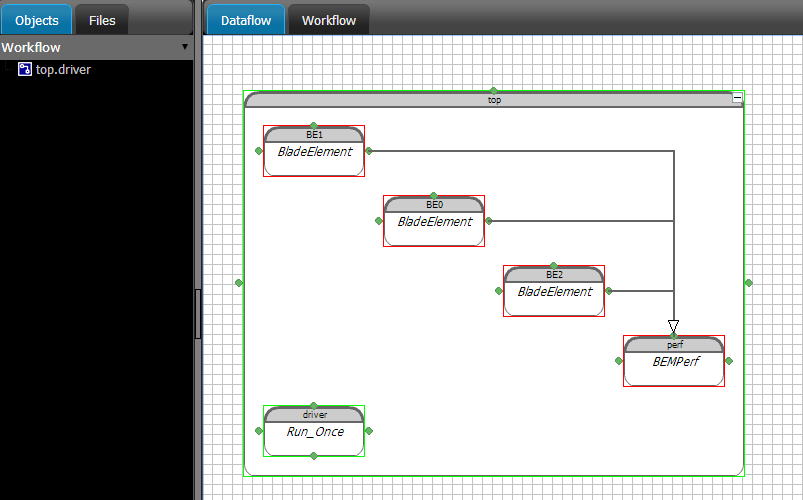
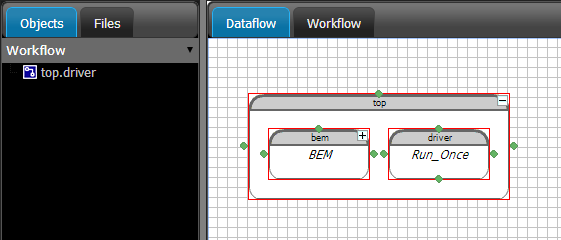
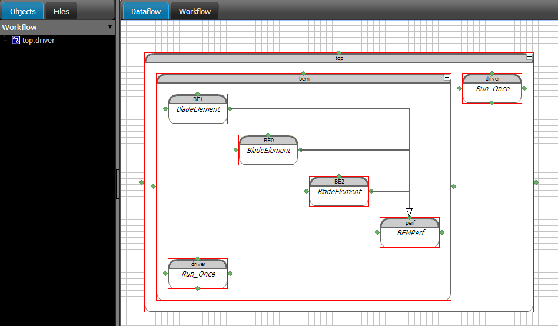
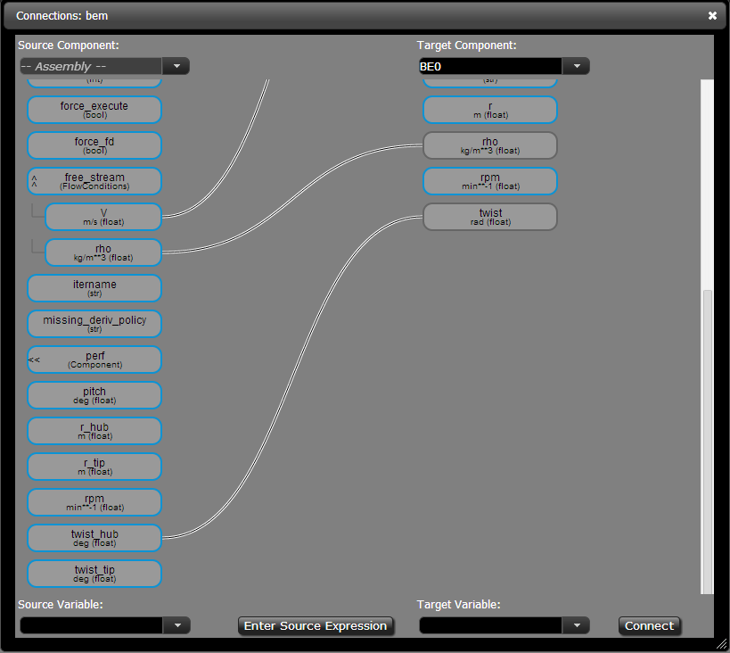
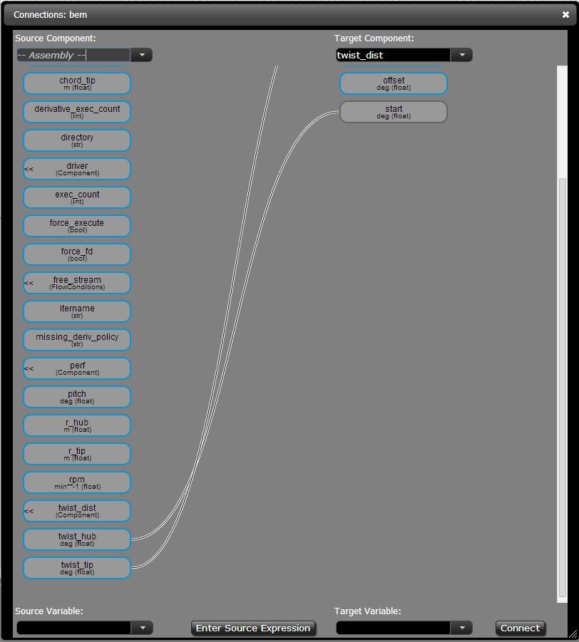
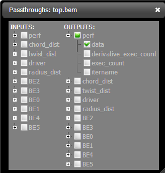

More Complex Wind Turbine Model - BEM Theory
=============================================================

In this part of the tutorial we'll build a much more complex (and interesting)
model for a wind turbine. We're going to use Blade Element Momentum (BEM) theory
to account for the actual geometry of a wind turbine in our analysis.

We're going to build our more complex model as an OpenMDAO Assembly and make use of
a number of OpenMDAO's more advanced features:

* VariableTrees for data encapsulation
* Automatic unit conversions between Components
* Assembly-level variables
* Assemblies as Components

After we build the BEM model, we will test it by running a Design of Experiments (DOE)
and an optimization with it. This should give you a good feel for what more detailed models
look like in OpenMDAO and how they can be used as components in a larger simulation.

The BEM analysis can be broken down into two main sub-calculations. First, with BEM
the rotor blade is broken up into a series of blade elements. Each blade element is
assumed to be independent from the others. The calculations for an individual blade element
are the first sub-calculation. Next, the rotor performance
can be calculated by aggregating the results from all of the blade elements. The rotor
performance is the second sub-calculation.

.. figure:: bem.png
    :align: center

Each sub-calculation will get handled in its own component class, which we will show you the
definition of.  But these classes are significantly larger and more complex than the
ActuatorDisk from earlier. So  if you don't want to define them yourself, it's fine to just use
the ones defined from the plugin. We're going to  show you the code, just to highlight a few key
things, and then we'll get to building the actual BEM model. If you  want to build the classes
yourself, just create new files in your project and copy the code we show you into them. Otherwise,
just read through the component details, and we'll get to the assembly construction in the GUI after
that.

Blade Element Component
------------------------------------------------------------------------

The code for a blade element is below. There are a lot of inputs and outputs, and
the calculations are not trivial. However, there are a couple of key features to take note of.

.. testcode:: blade_element_class

    from openmdao.main.api import Component
    from openmdao.lib.datatypes.api import Float,Int

    class BladeElement(Component):
        """Calculations for a single radial slice of a rotor blade"""

        # inputs
        a_init = Float(0.2, iotype="in", desc="initial guess for axial inflow factor")
        b_init = Float(0.01, iotype="in", desc="initial guess for angular inflow factor")
        rpm = Float(106.952, iotype="in", desc="rotations per minute", low=0, units="min**-1")
        r = Float(5., iotype="in", desc="mean radius of the blade element", units="m")
        dr = Float(1., iotype="in", desc="width of the blade element", units="m")
        twist = Float(1.616, iotype="in", desc="local twist angle", units="rad")
        chord = Float(.1872796, iotype="in", desc="local chord length", units="m", low=0)
        B = Int(3, iotype="in", desc="Number of blade elements")

        rho = Float(1.225, iotype="in", desc="air density", units="kg/m**3")
        V_inf = Float(7, iotype="in", desc="free stream air velocity", units="m/s")

        # outputs
        V_0 = Float(iotype="out", desc="axial flow at propeller disk", units="m/s")
        V_1 = Float(iotype="out", desc="local flow velocity", units="m/s")
        V_2 = Float(iotype="out", desc="angular flow at propeller disk", units="m/s")
        omega = Float(iotype="out", desc="average angular velocity for element", units="rad/s")
        sigma = Float(iotype="out", desc="Local solidity")
        alpha = Float(iotype="out", desc="local angle of attack", units="rad")
        delta_Ct = Float(iotype="out", desc="section thrust coefficient", units="N")
        delta_Cp = Float(iotype="out", desc="section power coefficent")
        a = Float(iotype="out", desc="converged value for axial inflow factor")
        b = Float(iotype="out", desc="converged value for radial inflow factor")
        lambda_r = Float(8, iotype="out", desc="local tip speed ratio")
        phi = Float(1.487, iotype="out", desc="relative flow angle onto blades", units="rad")

        def __init__(self):
            super(BladeElement, self).__init__()

            # rough linear interpolation from naca 0012 airfoil data
            rad = np.array([0., 13., 15, 20, 30])*pi/180
            self.cl_interp = interp1d(rad, [0, 1.3, .8, .7, 1.1], fill_value=0.001, bounds_error=False)

            rad = np.array([0., 10, 20, 30, 40])*pi/180
            self.cd_interp = interp1d(rad, [0., 0., 0.3, 0.6, 1.], fill_value=0.001, bounds_error=False)

        def _coeff_lookup(self, i):
            C_L = self.cl_interp(i)
            C_D = self.cd_interp(i)
            return C_D, C_L

        def execute(self):
            self.sigma = self.B*self.chord / (2 * np.pi * self.r)
            self.omega = self.rpm*2*pi/60.0
            omega_r = self.omega*self.r
            self.lambda_r = self.omega*self.r/self.V_inf  # need lambda_r for iterates

            result = fsolve(self._iteration, [self.a_init, self.b_init])
            self.a = result[0]
            self.b = result[1]

            self.V_0 = self.V_inf - self.a*self.V_inf
            self.V_2 = omega_r-self.b*omega_r
            self.V_1 = (self.V_0**2+self.V_2**2)**.5

            q_c = self.B*.5*(self.rho*self.V_1**2)*self.chord*self.dr
            cos_phi = cos(self.phi)
            sin_phi = sin(self.phi)
            C_D, C_L = self._coeff_lookup(self.alpha)
            self.delta_Ct = q_c*(C_L*cos_phi-C_D*sin_phi)/(.5*self.rho*(self.V_inf**2)*(pi*self.r**2))
            self.delta_Cp = self.b*(1-self.a)*self.lambda_r**3*(1-C_D/C_L*tan(self.phi))

        def _iteration(self, X):
            self.phi = np.arctan(self.lambda_r*(1+X[1])/(1-X[0]))
            self.alpha = pi/2-self.twist-self.phi
            C_D, C_L = self._coeff_lookup(self.alpha)
            self.a = 1./(1 + 4.*(np.cos(self.phi)**2)/(self.sigma*C_L*np.sin(self.phi)))
            self.b = (self.sigma*C_L) / (4 * self.lambda_r * np.cos(self.phi)) * (1 - self.a)

            return (X[0]-self.a), (X[1]-self.b)

Notice that one of the inputs is not a Float.

::

    B = Int(3, iotype="in", desc="Number of blade elements")

`B` is an integer, but it still takes similar arguments to a Float.
There are a lot of different kinds of OpenMDAO variables, including Enum, Array, Complex, and Str.
If none of the built-in types meet your needs you can `define your own custom variables.
<http://openmdao.org/docs/plugin-guide/variable_plugin.html>`_

The ``__init__`` method is defined for this component, which handles a bunch of things
that need to get done to initialize it for the analysis, like setting up some airfoil data. There are two
other functions that are defined as well. ``_iteration`` and ``_coeff_lookup`` are both internal helper
functions for BladeElement. The ``_iteration`` function is responsible for converging on the correct values
for axial and tangential induction factors. This iteration is called for by BEM theory.

Rotor Performance Component
------------------------------------------------------------------------

A rotor is made up from a set of blade elements. To calculate rotor performance data from each
element we will define a new BEMperf class. This class is a lot simpler than BladeElement, but
it also makes use of a few more features of OpenMDAO. So it has a couple of helper classes
that go along with it.

.. testcode:: rotor_perf_class

    from openmdao.main.api import Component, VariableTree
    from openmdao.lib.datatypes.api import Float

    class FlowConditions(VariableTree):
        rho = Float(1.225, desc="air density", units="kg/m**3")
        V = Float(7., desc="free stream air velocity", units="m/s")

    class BEMPerfData(VariableTree):
        """Container that holds all rotor performance data"""

        net_thrust = Float(desc="net axial thrust", units="N")
        net_power = Float(desc="net power produced", units="W")
        Ct = Float(desc="thrust coefficient")
        Cp = Float(desc="power coefficient")
        J = Float(desc="advance ratio")
        tip_speed_ratio = Float(desc="tip speed ratio")
        #eta = Float(desc="turbine efficiency")

    class BEMPerf(Component):
        """collects data from set of BladeElements and calculates aggregate values"""

        r = Float(.8, iotype="in", desc="tip radius of the rotor", units="m")
        rpm = Float(2100, iotype="in", desc="rotations per minute", low=0, units="min**-1")

        free_stream = VarTree(FlowConditions(), iotype="in")

        data = VarTree(BEMPerfData(), iotype="out")

        # this lets the size of the arrays vary for different numbers of elements
        def __init__(self, n=10):
            super(BEMPerf, self).__init__()

            # needed initialization for VTs
            self.add('data', BEMPerfData())
            self.add('free_stream', FlowConditions())

            # array size based on number of elements
            self.add('delta_Ct', Array(iotype='in', desc='thrusts from %d different blade elements' % n,
                                   default_value=np.ones((n,)), shape=(n,), dtype=Float, units="N"))
            self.add('delta_Cp', Array(iotype='in', desc='Cp integrant points from %d different blade elements' % n,
                                   default_value=np.ones((n,)), shape=(n,), dtype=Float))
            self.add('lambda_r', Array(iotype='in', desc='lambda_r from %d different blade elements' % n,
                                   default_value=np.ones((n,)), shape=(n,), dtype=Float))

        def execute(self):
            self.data = BEMPerfData()  # empty the variable tree

            V_inf = self.free_stream.V
            rho = self.free_stream.rho

            norm = (.5*rho*(V_inf**2)*(pi*self.r**2))
            self.data.Ct = np.trapz(self.delta_Ct, x=self.lambda_r)
            self.data.net_thrust = self.data.Ct*norm

            self.data.Cp = np.trapz(self.delta_Cp, x=self.lambda_r) * 8. / self.lambda_r.max()**2
            self.data.net_power = self.data.Cp*norm*V_inf

            self.data.J = V_inf/(self.rpm/60.0*2*self.r)

            omega = self.rpm*2*pi/60
            self.data.tip_speed_ratio = omega*self.r/self.free_stream.V

The two classes, FlowConditions and BEMPerfData, both inherit from VariableTree. In OpenMDAO,
VariableTree is the base class you should use if you want to pass around any kind of object that is
more  complicated than a simple scalar value or an array. These VariableTree sub-classes provide a
convenient way  of grouping related variables together, and they can serve as datatypes that are
declared as part of the i/o  for any component.

::

    class FlowConditions(VariableTree):
        rho = Float(1.225, desc="air density", units="kg/m**3")
        V = Float(7., desc="free stream air velocity", units="m/s")

Inside FlowConditions there are two variables. Just like before, they have a default value, a
description, and some  units defined. Notably missing, however, is an *iostatus*. When you are
defining the VariableTree sub-class, iostatus is not yet  relevant. When added to a component, the
variable tree iostatus as a whole could be specified as input or as output. Iostatus is defined
when the class is used as i/o in a component, not before. For our BEMPerf component, we use an
instance of FlowConditions called ``free_stream``.

::

    free_stream = VarTree(FlowConditions(), iotype="in")

The initialization method for the BEMPerf component is a bit different than the one for BladeElement as well.
Notice that ``free_stream`` and ``data`` (the two VaraibleTree class type i/o variables) are initialized.
You always need to initialize a VariableTree when used in a component. You just need to put an empty instance of the proper class
there with the ``add`` method of the component.

::

    # needed initialization for VTs
    self.add('data', BEMPerfData())
    self.add('free_stream', FlowConditions())

In the definition of the ``__init__`` method there is an optional argument ``n_elements``, which defaults to 10 if
not otherwise specified. This argument is used to define some Array variables, which have a specified size. The size
needs to change depending on how many BladeElement instances you need to get data from, so you have to define these
variables during the initialization. The ``add`` method is used to create these traits on the fly.
Notice that like Float, Array type variables can have units defined as well. The unit applies to all
members of the array at the same time.

::

    self.add('delta_T', Array(iotype='in', desc='thrusts from %d different blade elements'%n,
                              default_value=np.ones((n,)), shape=(n,), dtype=Float, units="N"))

BEM Rotor Assembly
------------------------------------------------------------------------

Now that we've defined the two primary components, we can create an assembly that uses them to
model a wind turbine. The component definition requires some coding, but this plugin has already
provided that for you. So create a new project in the OpenMDAO GUI, add a top assembly and then
filter the Library tab with `nrel.`  You should see all of the classes defined above show up
there, as well as two more: BEM and AutoBEM.

We'll get to BEM and AutoBEM in a bit, but first we're going to test out the BladeElement and
BEMPerf  components. From the Library, drag ``BladeElement`` into the ``top`` assembly, and give it
the name *BE0*. Then double-click on the newly-created instance and take a moment to  make sure all
the inputs and outputs are there. You could run this component by itself, but that's not very
interesting.  Create two more instances of ``BladeElement`` and name them *BE1* and *BE2*. Now you
have three BladeElements, so  create a ``BEMPerf`` instance named *perf* and set the number of
elements to 3 when prompted.

Now you want to connect the BladeElement instances and the BEMPerfComponent. Click and drag from the
small green circle on the right of *BE0* to small circle on the top of *perf*. This will bring up the
connection window.

We want to connect three variables from *BE0* to *perf*:

* ``BE0.delta_Ct`` to ``perf.delta_Ct[0]``
* ``BE0.delta_Cp`` to ``perf.delta_Cp[0]``
* ``BE0.lambda_r`` to ``perf.lambda_r[0]``

Just start typing each source and target name into the right and left input fields  respectively,
and select the variable from the suggestions when you see it pop up. Then click ``Connect``. When
each connection is made, it will get drawn in the window so you can see it.  When you're done, it
will look like this:

Go ahead and create similar connections for the other two BladeSegments, remembering to increment
the array index to *1* and then *2* for each one.  As the connections are made, you should see the
dataflow react by drawing dependency arrows between each of the BladeElements and the perf
component. These will be black, indicating that there is an  explicit data dependency. OpenMDAO
strictly enforces explicit connections so that if you tried to set a  value into a connected input,
you would get an error. Similarly, you can't give a connected input as a parameter  to a driver. The
driver cannot vary that value since it's explicitly connected to something else.

Now you've connected up your model. You're ready to run it, right? Well, not quite yet. For one
thing, your BladeElement instances all have default values for their inputs. It does not make much
sense to have  all three of them set to the same radius, twist, chord, etc. But let's pretend you set
some  carefully picked values into each of them, just for the sake of argument. So now are you ready
to run? Try it.

Right-click on the ``top`` assembly and select ``Run`` from the menu. The assembly and the driver will
both turn  green, but none of the other components will. Why not? Well, take a look at the workflow.
Even though you connected  all your components properly and (theoretically) set some good values into
the inputs, you never added anything to the workflow.

The last time you did not have to put anything into the assembly's workflow yourself, it
just happened automatically.  That automatic workflow came from adding parameters to the
driver. When you did that, OpenMDAO figured out that if the driver  was going to vary some
values, then the components attached to them would need to be executed. In this case
though, we've  not done anything to the driver. In fact, it's just the default RunOnce
driver which can't even accept any parameters or  objectives. So the workflow will need to
be created manually. Drag each of the components into the left side's Workflow tab and
then tell the assembly to run again. Now, all of the components will execute.

.. figure:: full_workflow.png
    :align: center

BEM Rotor as a Nested Assembly
------------------------------------------------------------------------

If you were really using BEM to do the aerodynamic design for a wind turbine,
then you'd be working with a  whole design team. The team would probably want to run your
aerodynamic analysis as part of a larger model of the actual  wind turbine system. Since
OpenMDAO's Assembly class is a sub-class  of Component, you can add i/o to an assembly and
use it as a component in a larger model.

So let's take a look at what the i/o for BEM analysis would look like:

.. testcode:: bem_definition

    from openmdao.main.api import Assembly
    from openmdao.lib.datatypes.api import Float, Int

    class FlowConditions(VariableTree):
        rho = Float(1.225, desc="air density", units="kg/m**3")
        V = Float(7., desc="free stream air velocity", units="m/s")

    class BEM(Assembly):
        """Blade Rotor with 3 BladeElements"""

        # physical properties inputs
        r_hub = Float(0.2, iotype="in", desc="blade hub radius", units="m", low=0)
        twist_hub = Float(29, iotype="in", desc="twist angle at the hub radius", units="deg")
        chord_hub = Float(.7, iotype="in", desc="chord length at the rotor hub", units="m", low=.05)
        r_tip = Float(5, iotype="in", desc="blade tip radius", units="m")
        twist_tip = Float(-3.58, iotype="in", desc="twist angle at the tip radius", units="deg")
        chord_tip = Float(.187, iotype="in", desc="chord length at the rotor hub", units="m", low=.05)
        pitch = Float(0, iotype="in", desc="overall blade pitch", units="deg")
        rpm = Float(107, iotype="in", desc="rotations per minute", low=0, units="min**-1")
        B = Int(3, iotype="in", desc="number of blades", low=1)

        # wind condition inputs
        free_stream = VarTree(FlowConditions(), iotype="in")

        def __init__(self):
            super(BEM, self).__init__()
            self.add('free_stream', FlowConditions())

        def configure(self):
            self.add('BE0', BladeElement())
            self.add('BE1', BladeElement())
            self.add('BE2', BladeElement())
            self.add('perf', BEMPerf(n=3))

            self.connect('BE0.delta_Ct', 'perf.delta_Ct[0]')
            self.connect('BE0.delta_Cp', 'perf.delta_Cp[0]')
            self.connect('BE0.lambda_r', 'perf.lambda_r[0]')

            self.connect('BE1.delta_Ct', 'perf.delta_Ct[1]')
            self.connect('BE1.delta_Cp', 'perf.delta_Cp[1]')
            self.connect('BE1.lambda_r', 'perf.lambda_r[1]')

            self.connect('BE2.delta_Ct', 'perf.delta_Ct[2]')
            self.connect('BE2.delta_Cp', 'perf.delta_Cp[2]')
            self.connect('BE2.lambda_r', 'perf.lambda_r[2]')

            self.driver.workflow.add(['BE0', 'BE1', 'BE2', 'perf'])

This code looks really similar to the previous component code we defined, except that our
class  inherits from Assembly instead of Component. We've defined 9 scalar input design
variables and one  VariableTree that holds an additional 2 scalar inputs that deal with the
wind conditions the turbine would  operate in. We also pre-defined the 3 BladeElement
components, the BEMPerf component, connected them  all, and added them to the workflow. This
way, you don't need to re-do all the connections by hand.

Create another new project in the OpenMDAO GUI. Create a ``top`` assembly. Filter the Library
with `nrel` again  and create an instance of the ``BEM`` assembly inside ``top``.
We named our instance `bem`. Your workspace will look like this when you're done:

You can click on the small ``+`` in the upper right corner of ``bem`` to see the contents of
your  newly created assembly.

You have an assembly with i/o and components connected and hooked up to a workflow. But you
still need to  connect the assembly i/o to the components it holds. There are two ways you can
do that. The first way, assuming you have existing variables defined like the inputs we
created, is to again use the connection editor. Right-click somewhere in the assembly and
select ``Edit Data Connections`` from the menu. This will bring up the  connection window.
This time, leave the source as ``-- Assembly --`` but set the target to *BE0*. Now  you can
connect the `rho` and `V` variables from the ``free_stream`` VariableTree and the `B`
variable  to the corresponding variables in the BladeElement. Repeat that for `BE1,
BE2`, and `perf.`

We're almost done, but we still need to deal with chord, radius, and twist. Chord and radius
are pretty straightforward, but if you look at twist carefully, you will see a small problem.
For the BladeElement, twist is given in radians, but in the BEM assembly, it's defined in
degrees.

Twist in the Rotor Assembly:

::

    twist_tip = Float(93.58, iotype="in", desc="twist angle at the tip radius", units="deg")

Twist in the Blade Element:

::

    twist = Float(1.616, iotype="in", desc="local pitch angle", units="rad")

Fortunately, OpenMDAO can easily handle this situation.  When you try to connect two variables
of different but compatible units, OpenMDAO will convert them for you on the fly. But if you
try to connect two variables with incompatible units, you'll get an error.  Give it a shot.
Try to connect the ``radius_hub`` variable from the assembly to ``BE0.twist``. You'll get an
error.  Then try to connect ``twist_hub`` to ``BE0.twist``. That will work just fine.

Connecting the hub and tip variables to *BE0* and *BE2* only gets us part of the way there. We still
need to  deal with *BE1* or potentially more intermediate BladeSegments if we had them. Let's assume
that this rotor  has a linear distribution for chord and twist. We'll also space the blade segment
radii out linearly from the  root to the tip. OpenMDAO provides a utility class for this called
`LinearDistribution`. If you filter  the Library with `linear,` you'll see it. You can create one
called ``twist_dist``. When asked, set the  number of elements to 3 and the units to ``'deg'`` (make
sure you add the quotes!). You don't have to specify units on a LinearDistribution, but  in this
case it's necessary to ensure proper unit conversion. Then you can connect the ``twist_hub`` and
``twist_tip`` variables from the assembly to the ``twist_dist.start`` and ``twist_dist.end``
variables.

Now you can connect the elements from the array ``twist_dist.output`` to ``BE0.twist``,
``BE1.twist``, and ``BE2.twist``.

.. figure:: twist_be.png
    :align: center

Notice that you just connected an item from an array to a scalar variable. OpenMDAO allows this type
of connection and performs the same kind of units validation that it does for regular scalar to
scalar connections. Similarly,  you can connect a sub-variable from within a VariableTree to a
scalar variable on another component. In fact, we did just that by connecting ``free_stream.rho`` to
``BE0.rho``, ``BE1.rho``, and ``BE2.rho``.

At this point, we're almost done. We still need to add LinearDistribution instances for the chord
and radius values. We also  have a few more assembly-level connections to make. You might have
noticed that the assembly does not have any outputs. So far we've only created inputs. We said there
were two ways to create assembly-level variables. The first is to manually  create them and then
issue connections, like we just explored. The second way is to use a passthrough. Right-click on
the  assembly and select ``Edit Passthroughs`` from the menu.

You can find the ``perf.data`` in the outputs column (right side) and check it. This will
automatically create an assembly-level variable called *data* and connect it to ``perf.data``.  This
is really just a shortcut for the first procedure, but it's easy to do at runtime if you have some
components, the  inputs or outputs of which you want to expose at the assembly's border. When you
create a passthrough, it creates an exact copy of the variable, including name and units
information. If you want to change the units across the boundary, like with the twist variables, you
have to do that manually.

