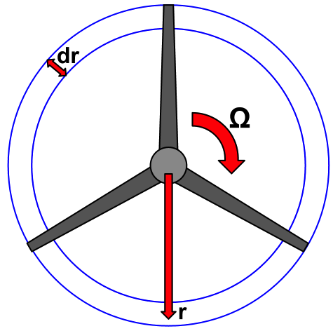

More Complex Wind Turbine Model - BEM Theory
=============================================================

In this part of the tutorial we'll build a much more complex (and interesting)
model for a wind turbine. We're going to use Blade Element Momentum (BEM) theory
to account for the actual geometry of a wind turbine in our analysis.

We're going to build our more complex model as an OpenMDAO Assembly and make use of
a number of OpenMDAO's more advanced features:

* VariableTrees for data encapsulation
* Automatic unit conversions between Components
* Assembly-level variables
* Assemblies as Components

The BEM analysis can be broken down into two main sub-calculations. First, with BEM
the rotor blade is broken up into a series of blade elements. Each blade element is
assumed to be independent from the others. The calculations for an individual blade element
are the first sub-calculation. Next, the rotor performance
can be calculated by aggregating the results from all of the blade elements. The rotor
performance is the second sub-calculation.

Each sub-calculation will get handled in its own component class, which we will show you the
definition of.  But these classes are significantly larger and more complex than the
ActuatorDisk from earlier. So  if you don't want to define them yourself, it's fine to just use
the ones defined from the plugin. We're going to  show you the code, just to highlight a few key
things, and then we'll get to building the actual BEM model. If you  want to build the classes
yourself, just create new files in your project and copy the code we show you into them. Otherwise,
just read through the component details, and we'll get to the assembly construction after
that.

Blade Element Component
------------------------------------------------------------------------

The code for a blade element is below. There are a lot of inputs and outputs, and
the calculations are not trivial. However, there are a couple of key features to take note of.

.. testcode:: blade_element_class

    from openmdao.main.api import Component
    from openmdao.lib.datatypes.api import Float,Int

    class BladeElement(Component):
        """Calculations for a single radial slice of a rotor blade"""

        # inputs
        a_init = Float(0.2, iotype="in", desc="initial guess for axial inflow factor")
        b_init = Float(0.01, iotype="in", desc="initial guess for angular inflow factor")
        rpm = Float(106.952, iotype="in", desc="rotations per minute", low=0, units="min**-1")
        r = Float(5., iotype="in", desc="mean radius of the blade element", units="m")
        dr = Float(1., iotype="in", desc="width of the blade element", units="m")
        twist = Float(1.616, iotype="in", desc="local twist angle", units="rad")
        chord = Float(.1872796, iotype="in", desc="local chord length", units="m", low=0)
        B = Int(3, iotype="in", desc="Number of blade elements")

        rho = Float(1.225, iotype="in", desc="air density", units="kg/m**3")
        V_inf = Float(7, iotype="in", desc="free stream air velocity", units="m/s")

        # outputs
        V_0 = Float(iotype="out", desc="axial flow at propeller disk", units="m/s")
        V_1 = Float(iotype="out", desc="local flow velocity", units="m/s")
        V_2 = Float(iotype="out", desc="angular flow at propeller disk", units="m/s")
        omega = Float(iotype="out", desc="average angular velocity for element", units="rad/s")
        sigma = Float(iotype="out", desc="Local solidity")
        alpha = Float(iotype="out", desc="local angle of attack", units="rad")
        delta_Ct = Float(iotype="out", desc="section thrust coefficient", units="N")
        delta_Cp = Float(iotype="out", desc="section power coefficent")
        a = Float(iotype="out", desc="converged value for axial inflow factor")
        b = Float(iotype="out", desc="converged value for radial inflow factor")
        lambda_r = Float(8, iotype="out", desc="local tip speed ratio")
        phi = Float(1.487, iotype="out", desc="relative flow angle onto blades", units="rad")

        def __init__(self):
            super(BladeElement, self).__init__()

            # rough linear interpolation from naca 0012 airfoil data
            rad = np.array([0., 13., 15, 20, 30])*pi/180
            self.cl_interp = interp1d(rad, [0, 1.3, .8, .7, 1.1], fill_value=0.001, bounds_error=False)

            rad = np.array([0., 10, 20, 30, 40])*pi/180
            self.cd_interp = interp1d(rad, [0., 0., 0.3, 0.6, 1.], fill_value=0.001, bounds_error=False)

        def _coeff_lookup(self, i):
            C_L = self.cl_interp(i)
            C_D = self.cd_interp(i)
            return C_D, C_L

        def execute(self):
            self.sigma = self.B*self.chord / (2 * np.pi * self.r)
            self.omega = self.rpm*2*pi/60.0
            omega_r = self.omega*self.r
            self.lambda_r = self.omega*self.r/self.V_inf  # need lambda_r for iterates

            result = fsolve(self._iteration, [self.a_init, self.b_init])
            self.a = result[0]
            self.b = result[1]

            self.V_0 = self.V_inf - self.a*self.V_inf
            self.V_2 = omega_r-self.b*omega_r
            self.V_1 = (self.V_0**2+self.V_2**2)**.5

            q_c = self.B*.5*(self.rho*self.V_1**2)*self.chord*self.dr
            cos_phi = cos(self.phi)
            sin_phi = sin(self.phi)
            C_D, C_L = self._coeff_lookup(self.alpha)
            self.delta_Ct = q_c*(C_L*cos_phi-C_D*sin_phi)/(.5*self.rho*(self.V_inf**2)*(pi*self.r**2))
            self.delta_Cp = self.b*(1-self.a)*self.lambda_r**3*(1-C_D/C_L*tan(self.phi))

        def _iteration(self, X):
            self.phi = np.arctan(self.lambda_r*(1+X[1])/(1-X[0]))
            self.alpha = pi/2-self.twist-self.phi
            C_D, C_L = self._coeff_lookup(self.alpha)
            self.a = 1./(1 + 4.*(np.cos(self.phi)**2)/(self.sigma*C_L*np.sin(self.phi)))
            self.b = (self.sigma*C_L) / (4 * self.lambda_r * np.cos(self.phi)) * (1 - self.a)

            return (X[0]-self.a), (X[1]-self.b)

Notice that one of the inputs is not a Float.

::

    B = Int(3, iotype="in", desc="Number of blade elements")

`B` is an integer, but it still takes similar arguments to a Float.
There are a lot of different kinds of OpenMDAO variables, including Enum, Array, Complex, and Str.
If none of the built-in types meet your needs you can `define your own custom variables.
<http://openmdao.org/docs/plugin-guide/variable_plugin.html>`_

The ``__init__`` method is defined for this component, which handles a bunch of things
that need to get done to initialize it for the analysis, like setting up some airfoil data. There are two
other functions that are defined as well. ``_iteration`` and ``_coeff_lookup`` are both internal helper
functions for BladeElement. The ``_iteration`` function is responsible for converging on the correct values
for axial and tangential induction factors. This iteration is called for by BEM theory.

Rotor Performance Component
------------------------------------------------------------------------

A rotor is made up from a set of blade elements. To calculate rotor performance data from each
element we will define a new BEMperf class. This class is a lot simpler than BladeElement, but
it also makes use of a few more features of OpenMDAO. So it has a couple of helper classes
that go along with it.

.. testcode:: rotor_perf_class

    from openmdao.main.api import Component, VariableTree
    from openmdao.lib.datatypes.api import Float

    class FlowConditions(VariableTree):
        rho = Float(1.225, desc="air density", units="kg/m**3")
        V = Float(7., desc="free stream air velocity", units="m/s")

    class BEMPerfData(VariableTree):
        """Container that holds all rotor performance data"""

        net_thrust = Float(desc="net axial thrust", units="N")
        net_power = Float(desc="net power produced", units="W")
        Ct = Float(desc="thrust coefficient")
        Cp = Float(desc="power coefficient")
        J = Float(desc="advance ratio")
        tip_speed_ratio = Float(desc="tip speed ratio")
        #eta = Float(desc="turbine efficiency")

    class BEMPerf(Component):
        """collects data from set of BladeElements and calculates aggregate values"""

        r = Float(.8, iotype="in", desc="tip radius of the rotor", units="m")
        rpm = Float(2100, iotype="in", desc="rotations per minute", low=0, units="min**-1")

        free_stream = VarTree(FlowConditions(), iotype="in")

        data = VarTree(BEMPerfData(), iotype="out")

        # this lets the size of the arrays vary for different numbers of elements
        def __init__(self, n=10):
            super(BEMPerf, self).__init__()

            # needed initialization for VTs
            self.add('data', BEMPerfData())
            self.add('free_stream', FlowConditions())

            # array size based on number of elements
            self.add('delta_Ct', Array(iotype='in', desc='thrusts from %d different blade elements' % n,
                                   default_value=np.ones((n,)), shape=(n,), dtype=Float, units="N"))
            self.add('delta_Cp', Array(iotype='in', desc='Cp integrant points from %d different blade elements' % n,
                                   default_value=np.ones((n,)), shape=(n,), dtype=Float))
            self.add('lambda_r', Array(iotype='in', desc='lambda_r from %d different blade elements' % n,
                                   default_value=np.ones((n,)), shape=(n,), dtype=Float))

        def execute(self):
            self.data = BEMPerfData()  # empty the variable tree

            V_inf = self.free_stream.V
            rho = self.free_stream.rho

            norm = (.5*rho*(V_inf**2)*(pi*self.r**2))
            self.data.Ct = np.trapz(self.delta_Ct, x=self.lambda_r)
            self.data.net_thrust = self.data.Ct*norm

            self.data.Cp = np.trapz(self.delta_Cp, x=self.lambda_r) * 8. / self.lambda_r.max()**2
            self.data.net_power = self.data.Cp*norm*V_inf

            self.data.J = V_inf/(self.rpm/60.0*2*self.r)

            omega = self.rpm*2*pi/60
            self.data.tip_speed_ratio = omega*self.r/self.free_stream.V

The two classes, FlowConditions and BEMPerfData, both inherit from VariableTree. In OpenMDAO,
VariableTree is the base class you should use if you want to pass around any kind of object that is
more  complicated than a simple scalar value or an array. These VariableTree sub-classes provide a
convenient way  of grouping related variables together, and they can serve as datatypes that are
declared as part of the i/o  for any component.

::

    class FlowConditions(VariableTree):
        rho = Float(1.225, desc="air density", units="kg/m**3")
        V = Float(7., desc="free stream air velocity", units="m/s")

Inside FlowConditions there are two variables. Just like before, they have a default value, a
description, and some  units defined. Notably missing, however, is an *iostatus*. When you are
defining the VariableTree sub-class, iostatus is not yet  relevant. When added to a component, the
variable tree iostatus as a whole could be specified as input or as output. Iostatus is defined
when the class is used as i/o in a component, not before. For our BEMPerf component, we use an
instance of FlowConditions called ``free_stream``.

::

    free_stream = VarTree(FlowConditions(), iotype="in")

The initialization method for the BEMPerf component is a bit different than the one for BladeElement as well.
Notice that ``free_stream`` and ``data`` (the two VaraibleTree class type i/o variables) are initialized.
You always need to initialize a VariableTree when used in a component. You just need to put an empty instance of the proper class
there with the ``add`` method of the component.

::

    # needed initialization for VTs
    self.add('data', BEMPerfData())
    self.add('free_stream', FlowConditions())

In the definition of the ``__init__`` method there is an optional argument ``n_elements``, which defaults to 10 if
not otherwise specified. This argument is used to define some Array variables, which have a specified size. The size
needs to change depending on how many BladeElement instances you need to get data from, so you have to define these
variables during the initialization. The ``add`` method is used to create these traits on the fly.
Notice that like Float, Array type variables can have units defined as well. The unit applies to all
members of the array at the same time.

::

    self.add('delta_T', Array(iotype='in', desc='thrusts from %d different blade elements'%n,
                              default_value=np.ones((n,)), shape=(n,), dtype=Float, units="N"))

BEM Rotor Assembly
------------------------------------------------------------------------

- basic setup
- linear distributions
- connections

