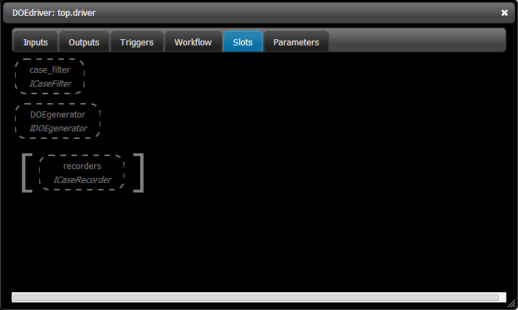
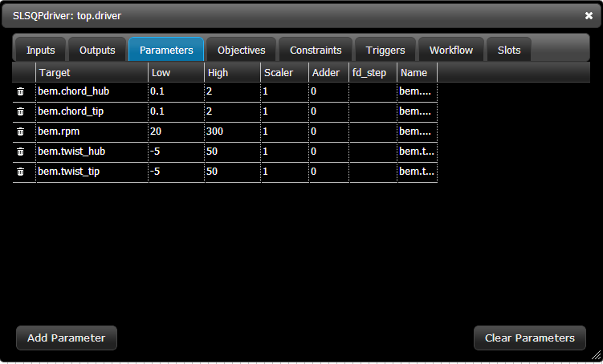

Design a Wind Turbine
=======================================

Using a DOE
------------------------------------

It was a good chunk of work to set up the full BEM model in OpenMDAO. You would not want to go
through that every time. This plugin comes with a pre-configured assembly that has all the necessary
connections and workflows already set up.  Start a new project again, add a top assembly and filter
the library on `nrel.` Add an instance of ``AutoBEM`` (with the default 6 elements) to the ``top``
assembly. We're going to treat this like any other component now and set up a DOE around it.

Filter the Library on `doe driver.` You'll see two options pop up. The first one, ``DOEdriver``,
will execute a specified DOE  on your model within the full specified variable ranges. The second
one, ``NeighborhoodDOEdriver``, will also run a DOE on your model,  but it does it in a small
neighborhood around the initial design point. The regular ``DOEdriver`` is the most traditional and
will be what you usually use. The ``NeighborhoodDOEdriver`` is more specialized but is very useful
for setting up complex  optimization algorithms like BLISS-2000 or trust-region-based surrogate
models.

We'll use the traditional DOEdriver for this work. Drag ``DOEdriver`` over and drop it on top of
``driver`` in ``top`` to replace it.  Now double-click on the new driver to see its editor window.
Like an optimizer, ``DOEdriver`` allows you to add parameters.  These parameters are how you tell
the driver what it can vary. Unlike an optimizer though, there is no objective tab, because a DOE
does not  have an explicit objective. Switch over to the *Slots* tab. The ``DOEdriver`` has several
new slots that we've not seen before.  We're going to use the ``DOEgenerator`` slot here, but you
can read about the ``case_filter`` and get plenty of other  details in our `docs
<http://openmdao.org/docs/tutorials/optimization/doe.html>`_.

Use `doegenerator` to filter the library. The list of five default DOEgenerator types will show up:

* **CentralComposite:** Central composite DOE
* **CSVFile:** A DOE from csv file with specific format
* **FullFactorial:** Full factorial DOE with :math:`l^n` cases where :math:`l` is the number of levels and :math:`n` is the number of parameters.
* **OptLatinHypercube:** Latin Hybercube DOE with Morris-Mitchell sampling criterion optimized
* **Uniform:** DOE with :math:`n` cases chosen from a uniform distribution

Let's use FullFactorial with 3 levels. We have 5 design variables, which gives us :math:`3^5=243`
cases. Drag ``FullFactorial`` from the library  and drop it on top of the ``DOEgenerator slot``. When
prompted, enter 3 for the number of levels. Also, add a ``CSVCaseRecorder`` so  we can look at the
results.  All of the default settings for the CSVCaserecorder will work fine. Now switch over to the
Parameters tab and add the 5 parameters from the BEM model.

Before we run, we want to add a couple of extra variables to be recorded into our CSV file. By
default all of the DOE inputs will be recorded, but none of the outputs will be. On the Inputs
tab, there is a variable called ``case_outputs``. We can give that a list of all the variables it
should include in each row of the CSV file. Note that you have to give a list of strings with the
variable names. The quotations (single or double) are important.

::

    ['bem.perf.data.tip_speed_ratio','bem.perf.data.Cp','bem.perf.data.Ct']

Now, run the assembly. It will take a minute to finish since it's running so many cases. When it
finishes, click on the Files tab.  A few new files have shown up. The first one is ``cases.csv``,
and a second one is the timestamped archive version of the same file.  Lastly, you see the
``driver.csv`` file. This last file is output by DOEdriver and serves as a record of which cases
were run, in normalized  DOE form. You can take this file and give it directly to a CSVFile
DOEgenerator to re-run the exact same cases. For something like FullFactorial,  this is not really
needed, but for OptLatinHyperCube or Uniform, you need this in order to run the same cases
repeatedly (after you generated the first random DOE).

Changing from a DOE to an Optimization
--------------------------------------------

If you scan through the data in the CSV file, you can see that even with 243 tries, a DOE was not
very effective at finding  designs with high power coefficients. So let's replace the DOEdriver with
an optimizer. Filter the Library with `optimizer` and drag ``SLSQPdriver`` and drop it on top of
``driver`` to replace it. Notice that the implicit data dependency connector is still there  after
you replace driver with an optimizer. If you double-click on ``driver`` and check the Parameters tab,
you'll see that all the parameters you had before were preserved.

So now, add ``-bem.data.Cp`` as an objective. Before we run the model, let's reload it to get back to a
decent initial condition. You could manually set the values back yourself, but reloading works too. The
issue is that the DOEdriver leaves the model in the same state as the last case it ran. You really  want a
clean initial starting point, so just reload the model. You'll see that the driver replacement and the
objective will still be there. Or, you can  manually reset the starting point with these values:

* chord_hub: .7
* chord_tip: 0.187
* rpm: 107
* twist_hub: 29
* twist_tip: -3.58

Now run the optimization and you'll see a pretty decent design show up, with a Cp of .56. That's not
too shabby considering Betz limit is around .59.

Conclusion
==========================

That concludes the tutorial for working with OpenMDAO. We've walked through simple and more complex
wind turbine models and have seen many of the features that OpenMDAO supports. We've built Python
components and linked them together into more complex models.  We've set up optimizations and DOE
analyses on top of those models.

Although we've seen many features of OpenMDAO, there are still plenty of other capabilities to check out. Our
documentation includes tutorials on  working with different kinds of code wrappers, so you can interface your
analyses with OpenMDAO. There are examples of wrapping  `C and Fortran with F2PY
<http://openmdao.org/docs/plugin-guide/extension_plugin.html#creating-an-extension-with-f2py>`_  and integrating
`C or C++ with SWIG
<http://openmdao.org/docs/plugin-guide/extension_plugin.html#creating-an-extension-with-swig>`_.  If you are
file wrapping codes, there are tools to help with that. There are tools for both standard  `file wrapping
<http://openmdao.org/docs/plugin-guide/filewrapper_plugin.html>`_ and for  `Fortran namelist inputs
<http://openmdao.org/docs/plugin-guide/filewrapper_plugin.html#generating-the-input-file-fortran-namelists>`_.
We also have tutorials for working with other common MDAO techniques, such as `MetaModeling
<http://openmdao.org/docs/tutorials/surrogate/index.html>`_ and `Optimization architectures
<http://openmdao.org/docs/tutorials/mdao/index.html>`_. And even these do not exhaust all the capabilities.

If you're interested in contributing to the OpenMDAO project, there are plenty of options. We're an open
source project, and we welcome code contributions from the community. We also have a plugin system in
OpenMDAO that allows you to produce plugins for just about anything within the framework. We've already had
a few plugin contributions from the community. We host our plugins on a GitHub project called
`OpenMDAO-Plugins <http://github.com/openmdao-plugins>`_. If you have any questions, our `forums
<http://openmdao.org/forum>`_ should be your first stop. The forums are actively monitored by the OpenMDAO
development team, and you'll get an answer very quickly from there!

