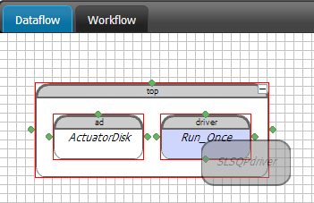
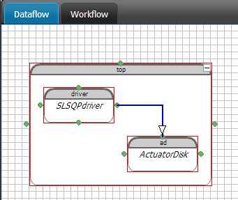
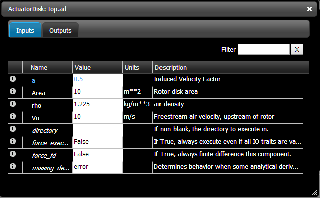

Building an Assembly- Unconstrained Optimization for the Betz Limit
=============================================================

Assembling a model
-----------------------

Components are connected to form a larger model using a construct in 
OpenMDAO called an ``Assembly``. Unlike components, assemblies can be nested in even
larger assemblies. Although nesting assemblies often makes sense from an
organizational persepctive, there are computational trade-offs to be considered.
These trade-offs are beyond the scope of this tutorial, but it's generally
advisable to keep models somewhat shallowly nested.

Assembly files are comprised of the same three parts as a component files.

- Importing Libraries
- Class Definition
- Stand-Alone Testing

While importing and testing work exactly the same as :ref:`components <BuildingAComponent>`,
the assembly class definition requires a configure method
(as opposed to an execute method in components).

Assembly Class Definition
-----------------------
An assembly class definition containes a minimum of three things:

- Class name declaration
- Input and output variable definition
- Configure method

**Class name declaration**

As an example::

    from openmdao.main.api import Assembly

    class Betz_Limit(Assembly):
        """Simple wind turbine assembly to calculate the Betz Limit"""

Our class is named ``Betz_Limit`` and it inherents from the Assembly
base class that we imported above.

**Input/Output Variable Definition**

Next, the inputs and outputs of the component class must be defined.

::

    class Betz_Limit(Assembly):
        """Simple wind turbine assembly to calculate the Betz Limit"""

        # Inputs
        a = Float(.5, iotype="in", desc="Induced Velocity Factor")

        # Outputs
        Vr = Float(iotype="out", desc="Air velocity at rotor exit plane", units="m/s")

So far so easy, this looks almost exactly like a component. Configuration
introduces a few new OpenMDAO concepts.

Configuring Assemblies
=========================================

OpenMDAO assemblies contain a *method* (function) called configure, it inherits
from it's class definition ``self`` and contains general information about the
assemblies internal structure and solver behavior.
An assembly configuration usually includes:

::

    def configure(self):
        """things to be configured go here"""

- Adding component/assembly instances
- Modifying the driver
- Adding components/assemblies to the workflow
- Connecting components/assemblies to each other

Let's walk through the reasoning and syntax for each aspect.

**Adding components/assemblies to the workflow**

Although we've defined a component class we need to create an *instance* of the
object, just as we did in the :ref:`component testing script <ifNameEqualsMain>`.
If you're unfamiliar with object oriented programming, class definitions are
analogous to blueprints or templates for a design.
Instances represent actualized objects created from the blueprint or template.

As an example,
    ``jeff = teacher()``

    ``tristan = teacher()``

creates two instances, named ``jeff`` and ``tristan``, derived from the same
class: ``teacher``. We've already used this concept when creating float
instances in the previous component :ref:`tutorial <ComponentDefinition>`.

``a = Float(.5, iotype="in", desc="Induced Velocity Factor")``

creates an instance of the ``Float`` class called ``a``, with *arguments* within
the parentheses.

Likewise, this assembly class (or blueprint/template) definition contains
at least one of instance of a sub-assembly or sub-component.

::

    def configure(self):

        aDisk = self.add('actDisk', ActuatorDisk())

This line does a few things, it creates an instance of the ``ActuatorDisk()``
class called ``actDisk``, adds it to the 'Betz_Limit' assembly and creates a
local variable called ``aDisk``. It is perfectly fine (and often much more
convenient) to name the local variable the same as the instance name.

    ``aDisk = self.add('actDisk', ActuatorDisk())``  <--  works

    ``aDisk = self.add('aDisk', ActuatorDisk())`` <-- also works

    ``self.add('aDisk', ActuatorDisk())``  <--is the same as above,
    but no local variable is created

as discussed earlier, if a local variable isn't created, the variable is
referenced with the ``self.<variableName>`` prefix. Remember to import any
classes that you instantiate at the top of the assembly file.

**Modifying the driver**

**Connecting components/assemblies to each other**

Start a new OpenMDAO GUI project from the project screen. You can name it whatever you want, but
we're going to  call it `Betz Limit`. Once the project opens up, create a ``top`` assembly as you
did before. Then filter the library with `nrel` and you should see all the classes for this tutorial.
Add an instance of ``ActuatorDisk`` from the library to the ``top`` assembly. We named our instance `ad`.

Now you've added a component instance into the ``top`` Assembly. But you can't do much with it,
except set the inputs  and run that component. To set up an optimization, you need to add a
different driver. So filter the library with `opt` to see a list of optimizers. We're going to
start with SLSQPdriver for this tutorial. Drag an instance of ``SLSQPdriver`` over to the ``top``
Assembly and drop it on top of the ``Run_Once`` driver that's already there. The driver should become
highlighted in blue when you're hover over it. When you drop a component onto an existing
component, you're  replacing that component rather than creating a new one.

.. _`relace_driver`:

   Replacing something by dropping on top of it

Configure the Optimization
---------------------------

Once you have the SLSQPdriver instance in there, you're ready to configure the optimization.
Double-click on the driver to bring up its editor window. You should see a few tabs in that window:

* Inputs
* Parameters
* Trigger
* Outputs
* Objectives
* Workflow
* Slots
* Constraints

The Inputs and Outputs tabs contain variables that are specific to the driver. These could be for
settings specific to the  optimizer or for framework variables like execution count. To set up the
optimization we'll first look at the Parameters and Objectives tabs.

We're going to set up an optimization to look for Betz's limit. This is a well-known result that
states that for a wind turbine, as you try  to extract more and more velocity from the incoming
wind, the best you can do is to extract about 60% of the power from the wind. This result comes from
an analysis of the equations used to build  our ActuatorDisk component. We'll try to use an
optimizer to confirm that our component returns the correct value for Betz's limit.

First, open the Parameters tab. Click on the ``Add Parameter`` button. A small dialog will open up
that lets you specify which parameter you want to give to the optimizer. If you hit the down arrow,
you will get a list of all the available variables. Pick ``ad.a``. This is the  axial induction
factor, or a ratio of the incoming wind velocity to the velocity after it exits the turbine. You'll
notice that when you picked that variable, the low and high values were automatically filled in for you.
These came from the variable metadata which specified a low and a high of 0 and 1 respectively. You
could shrink these ranges if you wished but not expand them. The 0 and 1 are hard limits set by the
component and can't be violated. We'll leave them as is. You will also notice the optional
`scaler` and `adder` fields. These are available for you to scale and shift your parameter if
necessary to give a more stable optimization. Once you hit ``Ok``, you should see the dataflow
diagram change a bit. The blue connector that showed up indicates that there is an implicit
connection between the driver and the component.  The connection is implicit because the driver will
set the value of ``ad.a`` during the optimization, but you can also change the value.  Whatever you
set the value to will be used as the initial condition for the optimization.

If you double-click on an instance now, you will see that the `a` variable in the editor window is also
highlighted in blue. All variables with implicit connections will be shown in in blue.

We also need to specify an objective. Go to the driver's Objectives tab and click ``Add Objective``.
Optimizers by default will  try to minimize the objective, so set the objective to ``-ad.Cp`` to get a
maximization. You'll see a new feedback connector  show up in the dataflow when you do this. This
indicates that the optimizer is now dependent on values from the component.

.. figure:: feedback.png
    :align: center

The Workflow
---------------------------

You might have noticed that when you added the first parameter to the optimizer, the workflow changed.
OpenMDAO figured out that since  the optimizer was varying a value in the `ad` component, it would
need to be in the workflow for that driver. So it added `ad` to the  workflow for you. It's important
to remember that OpenMDAO distinguished between the dataflow and the workflow. The dataflow describes
which  components communicate with others, but it says nothing about when that communication happens.
The order of execution is determined by the  workflow. Although the dataflow does not define the
workflow, it can constrain it. For example, if you have two components, `a` and `b`,  where `a` has an
output connected to the input of `b`, then you must run `a` before `b`.  In most cases, the
automatically created workflow will work just fine.  Just know that if you need to modify the workflow
to add a sub-solver loop or introduce some metamodel training, the flexibility is there.

Run the Optimization
---------------------------

So you're ready to run. Just right-click on the assembly ``top`` and pick ``Run`` from the context menu.
This will cause the whole assembly to execute and will run your optimization for you. Double-click on
the component when it's finished, and you will see that the optimizer found a value of  approximately
1/3 for axial induction factor, yielding a power coefficient just under .6. Congratulations! You have
just found Betz's limit. You can close down the project for now.

