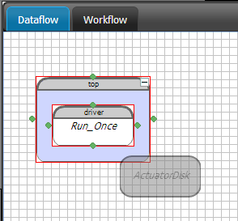
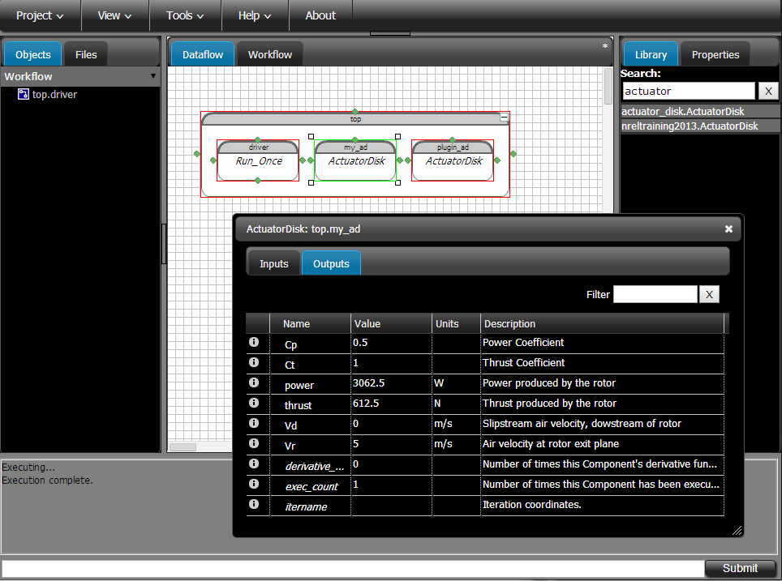

=============================================================
Building a Component - Actuator Disk
=============================================================

Adding Files to your GUI Project
=========================================

So the first thing we will do is create a new file in which to put some code to define our new
actuator disk component.  Click on the Files tab and then right-click to open a context menu. Select
``New File`` from the context menu, and finally, enter a name for the new  file. Let's call it
``actuator_disk.py``. (Note that the file extension is important, so make sure you add the ``.py``.)
Now double-click in the newly created file in the Files tree to open the GUI text editor in a new
window. If you don't  see the text editor come up, check to make sure its launch was not blocked by
a pop-up blocker. If it was blocked, you might need to add an exception for the GUI to your pop-up
blocker. Once the text editor is open, you're ready to build your first OpenMDAO Component class.

If you have some files on your computer that you want to use, you can add them to the project in
a similar way. On the Files tab,  right-click to get to the context menu and select ``Add Files``.
Choose the files you want to add from your computer, and they will be added to the project. Note that
the files you add to a project are copied and stored in your project. If you make any changes to the
original local files, those changes will not be reflected in the GUI project. You can modify your
project files within the GUI by using the text editor, or you can re-add them if you make changes
outside the GUI.

Defining a Component
=========================================

In this part of the tutorial, we're going to define a component that uses
actuator disk theory to provide a very simple model of a wind turbine. With
actuator disk theory, we will reproduce a very well-known engineering design
limitation called the Betz limit.

.. figure:: actuator_disk.png
   :align: center

   Actuator disk

With actuator disk theory, you treat the entire rotor as a single disk that
extracts velocity uniformly from the incoming flow and converts it to
power. If you define the upstream, rotor, and downstream velocities as
:math:`V_u`, :math:`V_r`, :math:`V_d` respectively, then you can describe the
axial induction factor, :math:`a`, as the amount of velocity extracted from the
flow. :math:`a = \frac{V_u-V_r}{V_r}`

A component takes a set of inputs and operates on them to produce a set of
outputs. In the OpenMDAO framework, a class called *Component*
provides this behavior. Any Component has inputs and outputs and
contains a function called *execute* that calculates the outputs based on the
values of the inputs. Let's take a look at how you would implement the
actuator disk analysis as an OpenMDAO component:

.. testcode:: simple_component_actuatordisk

    from openmdao.main.api import Component
    from openmdao.lib.datatypes.api import Float

    class ActuatorDisk(Component):
        """Simple wind turbine model based on actuator disk theory"""

        # inputs
        a = Float(.5, iotype="in", desc="Induced Velocity Factor")
        Area = Float(10, iotype="in", desc="Rotor disk area", units="m**2", low=0)
        rho = Float(1.225, iotype="in", desc="air density", units="kg/m**3")
        Vu = Float(10, iotype="in", desc="Freestream air velocity, upstream of rotor", units="m/s")

        # outputs
        Vr = Float(iotype="out", desc="Air velocity at rotor exit plane", units="m/s")
        Vd = Float(iotype="out", desc="Slipstream air velocity, downstream of rotor", units="m/s")
        Ct = Float(iotype="out", desc="Thrust Coefficient")
        thrust = Float(iotype="out", desc="Thrust produced by the rotor", units="N")
        Cp = Float(iotype="out", desc="Power Coefficient")
        power = Float(iotype="out", desc="Power produced by the rotor", units="W")

        def execute(self):
            # we use 'a' and 'V0' a lot, so make method local variables

            a = self.a
            Vu = self.Vu

            qA = .5*self.rho*self.Area*Vu**2

            self.Vd = Vu*(1-2 * a)
            self.Vr = .5*(self.Vu + self.Vd)

            self.Ct = 4*a*(1-a)
            self.thrust = self.Ct*qA

            self.Cp = self.Ct*(1-a)
            self.power = self.Cp*qA*Vu

In Python, a class or function must be imported before it can be used. Most of what you need in
OpenMDAO can be imported from ``openmdao.main.api`` and the ``openmdao.lib`` api modules:

* ``openmdao.lib.caseiterators.api``
* ``openmdao.lib.caserecorders.api``
* ``openmdao.lib.components.api``
* ``openmdao.lib.datatypes.api``
* ``openmdao.lib.doegenerators.api``
* ``openmdao.lib.drivers.api``
* ``openmdao.lib.surrogatemodels.api``

The first two lines in the ``actuator_disk.py`` module import the definitions
of the Component class and the Float class. Component is the base class
that you inherit from to build the ActuatorDisk class. Since all the inputs
for this model are floats, you need only the Float variable type for this work.
A full complement of other variable types is available in openmdao. You can see
the details on the others `here <http://openmdao.org/docs/basics/variables.html>`_.

.. testcode:: simple_component_pieces

    from openmdao.main.api import Component
    from openmdao.lib.datatypes.api import Float

You could import many other objects from ``openmdao.main.api`` and ``openmdao.lib.datatypes.api``,
but to keep things neater, you should import only the classes that you need for your particular
component. In other words:

.. testcode:: package

    # BAD
    from openmdao.main.api import *

    # INCONVENIENT
    import openmdao.main.api

    # GOOD
    from openmdao.main.api import Component

The next line defines a class called `ActuatorDisk`:

.. testcode:: simple_component_pieces

    class ActuatorDisk(Component):
        """Simple wind turbine model based on actuator disk theory"""

.. index:: classes, functions

You define the ActuatorDisk class by deriving it from the Component class. All of your analyses will
derive from the Component class, and typically you need to provide just two functions -- one to
initialize anything that needs to be set up once and another one to execute the component
(calculate the outputs from the inputs.)

Right now, your ActuatorDisk class is defined but has no inputs, no  outputs, and an ``execute``
function that does nothing. So the next thing you need to do is define the inputs and outputs in
the class definition by adding some definitions:

.. testcode:: simple_component_pieces

    class ActuatorDisk(Component):
        """Simple wind turbine model based on actuator disk theory"""

        # inputs
        a = Float(.5, iotype="in", desc="Induced Velocity Factor")
        Area = Float(10, iotype="in", desc="Rotor disk area", units="m**2", low=0)
        rho = Float(1.225, iotype="in", desc="air density", units="kg/m**3")
        Vu = Float(10, iotype="in", desc="Freestream air velocity, upstream of rotor", units="m/s")

        # outputs
        Vr = Float(iotype="out", desc="Air velocity at rotor exit plane", units="m/s")
        Vd = Float(iotype="out", desc="Slipstream air velocity, downstream of rotor", units="m/s")
        Ct = Float(iotype="out", desc="Thrust Coefficient")
        thrust = Float(iotype="out", desc="Thrust produced by the rotor", units="N")
        Cp = Float(iotype="out", desc="Power Coefficient")
        power = Float(iotype="out", desc="Power produced by the rotor", units="W")

.. index:: Traits

In Python, all objects have *attributes*, but making all of those attributes
visible to the framework would be overwhelming, so OpenMDAO requires you to
declare what we call *Variables* to indicate the specific inputs and outputs
that you want your component to make available to other components. Variables
are usually declared in the class definition of a component.

In the above example, all of your inputs and outputs are floating point numbers, so
you will use a type of variable called *Float*. The Float constructor contains
a default value and some arguments.

The argument *iotype* declares this variable as an input or an output. This
argument is required. If it is omitted (or misspelled), then the variable
won't be visible in the framework.

The optional argument *desc* contains a description, or a string of text that describes this
variable. This argument, while not required, is encouraged.

The optional argument *units* specifies (if applicable) the physical units the value should have.
If given, OpenMDAO will perform automated unit checking and, if possible, conversion, when a
variable with units is connected to another variable.

Finally, you need a function to execute this component:

.. testcode:: simple_component_Paraboloid_pieces

    def execute(self):
            # we use 'a' and 'V0' a lot, so make method local variables

            a = self.a
            Vu = self.Vu

            qA = .5*self.rho*self.Area*Vu**2

            self.Vd = Vu*(1-2 * a)
            self.Vr = .5*(self.Vu + self.Vd)

            self.Ct = 4*a*(1-a)
            self.thrust = self.Ct*qA

            self.Cp = self.Ct*(1-a)
            self.power = self.Cp*qA*Vu

The ``execute`` function is where you define what a component does when it runs.
The input and output variables are attributes of the ActuatorDisk class, which means that
they must be accessed using *self*. For example, ``self.a`` gives you the value
stored in ``a``. This ``self.`` can be cumbersome if you use it a lot, so you might
find it convenient to create a couple of function-local variables as shortcuts.
We do this with `a` and `Vu`.

Often, you will already have the code for evaluating your component outputs, but it will be in
some other language, such as Fortran or C/C++. The `Plugin-Developer-Guide
<http://openmdao.org/docs/plugin-guide/index.html>`_  gives some examples of how to incorporate
these kinds of components into OpenMDAO.

With these changes made to your class, you may now close the text editor window, which saves your
file, and go back to the main GUI screen. On the right-hand side of the window is the Library tab,
which you used earlier to create your top-level Assembly. You can use the Library tab to navigate
the list of all available classes in your current working environment. The library will include
everything from the OpenMDAO standard library, everything from any plugins you have installed,
and everything from the files in your current project.  In this case, the file we've created has
defined the ActuatorDisk component, so once you finish editing the file, it should become available
in your Library.

Working with the Library
=========================================

Since there are a lot of choices in the OpenMDAO library, you can filter down the options easily
using the text field at the top of the library. You can search by class name, component type, or
component metadata. Try searching for `optimizer.` You should see the list of optimizers from
the OpenMDAO standard library:

* COBYLAdriver
* CONMINdriver
* Genetic
* NEWSUMTdriver
* SLSQPdriver

To find your newly defined ``ActuatorDisk`` component, filter with `actuator.` You should see
two results:

* actuator_disk.ActuatorDisk
* nreltraining.ActuatorDisk

There are two results for this search because a class named ``ActuatorDisk`` is defined in two
separate  files. You defined it in your newly created project file, and it has also been
pre-defined for you as  part of this plugin.

Lastly, try searching for `nrel.` This will bring up a list of all the classes defined in this
plugin. They all show up because `nrel` appears in their file name:

* BEM
* BEMPerf
* BEMPerfData
* BladeElement
* nreltraining.ActuatorDisk
* SmallBEM

Running your Component
=========================================

So, now you've defined your class and found our reference implementation from the plugin. Let's
create  an instance of each one and make sure they give the same results. First, click and drag
``actuator_disk.ActuatorDisk`` from the library and drop it into the ``top`` assembly in the
dataflow tab. The assembly should become highlighted in blue when you're dropping it in the right
place. OpenMDAO will ask you  to give an instance name; we went with ``my_ad``. Also, use the same
process to create an instance of the plugin version of ActuatorDisk and call it  ``plugin_ad``.

.. _`create_actuatordisk`:

    Creating the ActuatorDisk instance in the Dataflow

Double-clicking on either of the newly created ActuatorDisk instances opens their respective
component editor windows.  From the component editor, you can see all the information about this
component (e.g., its inputs and outputs).  You'll notice that the inputs are the same for both
instances since they are at default values. If you check the outputs, you'll see that they are
all 0. The components are outlined in red right now, because they have not been run and their
outputs are not yet valid. To run the components, right-click on each one and select ``run``
from its context menu.  The component outline should change to green, indicating that it is now
valid. If you look at the outputs, you should see  that Cp is .5 for both instances. You can
change any input value you want. Try changing the value for `a` to something  else. When you
change it, the outline should go back to red, since the outputs are no longer valid for the new
inputs.

    ActuatorDisk outputs

Finishing Up
=========================================

Thats it! You've built your first OpenMDAO Component and used it in the GUI. To close down the
project just go to the ``Project`` menu and  select ``Close``. This should take you back out to
the projects screen.
