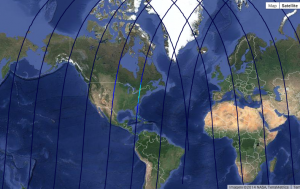
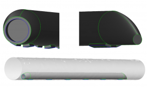
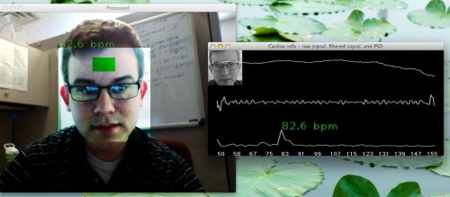

================
Getting Started
================

This plugin contains the documentation and component definitions for the
OpenMDAO instructional class that was given at the  National Renewable Energy
Laboratory (NREL) Wind Energy Systems Engineering workshop.
The class was given by Tristan Hearn and Jeff Chin of the NASA Glenn
Research Center. Tristan and Jeff are members of the OpenMDAO development team
and built the content of this class to demonstrate the basic usage of OpenMDAO
on some simple wind turbine design problems. The class covers:

- Understanding the use cases of OpenMDAO
- Basic usage for creating components
- Building optimizations around models, working with design of experiments
- Recording data from your runs
- Building more complex/robust models

The plugin and this tutorial have been updated for compatibility with
OpenMDAO Version 0.10.3.2

What is OpenMDAO?
========================

OpenMDAO is a Multidisciplinary Design Analysis and Optimization
(MDAO) framework, written in Python.

5 Core Principles of OpenMDAO:

**1. Open-Source and Professionally Maintained**

OpenMDAO provides a common platform for researchers and engineers to tackle complex multidisciplinary problems. Completely free and released under the `Apache v2.0  <http://www.apache.org/licenses/LICENSE-2.0>`_ license to enable greater collaboration and accessibility. The framework is built and maintained by NASA computer scientists with continuous bleeding-edge development at no cost to you.

**2. Powerful Algorithms**

All the flexibility of the Python language, with much of the engineering scaffolding done for you. Spend less time writing error-prone boilerplate code to connect, drive, parallelize, and solve your system; giving you more time to focus on the engineering. Find out more about the features `here <http://openmdao.org/what-is-openmdao/features/>`_.

**3. Common Resource for Design Optimization**

Researchers and engineers from many organizations, academia, and industry are contributing to the continuing development of the framework and submitting their new analysis techniques as components. In particular, it should be noted that even though the current toolsets are being developed to address a need in the design of conventional and unconventional aircraft, the framework is not restricted to that use alone. The OpenMDAO framework is useful for any application in the milieu of multidisciplinary analysis and optimization.

**4. Interoperable**

OpenMDAO works as the glue between disparate codebases, easily interfacing with a wide range of toolsets. The plugin tool makes it easy to install plugins with automatically integrated sub-documentation. The official plugin library can be found `here <https://github.com/OpenMDAO-Plugins>`_. Users are encouraged to contribute their own plugins as well.

**5. Development Tools [coming soon]**

These tools help you build models faster, manage large datasets, and visualize the connections and convergence of highly coupled systems. Get a better grasp on the complex behavior of your model and spend less time debugging.

Who Uses OpenMDAO?
========================

Government

- NASA
- NREL
- Sandia

Academia

- Stanford
- U Michigan
- Purdue
- Technical University of Denmark
- Texas A & M

Industry

- Boeing
- AeroVelo
- M4 Engineering

What has OpenMDAO been used for?
========================
To name a few:

**Satellite Design**

Since 0.9.0 OpenMDAO has had a new derivatives system that can handle really large design spaces. What does really large mean? We've tested the capability (in fact, we developed the capability around) a 25,000-design-variable problem. You can read all about the details in the `online docs <http://openmdao-plugins.github.io/CADRE/>`_, which include some `interactive data visualization <http://openmdao-plugins.github.io/CADRE/full.html#interactive-visualization-of-results>`_ with Google Earth. The docs tell you how to install and run the this test problem for yourself.

We worked closely with the University of Michigan MDO lab to implement their `problem for a small satellite design <http://mdolab.engin.umich.edu/content/large-scale-multidisciplinary-optimization-small-satellite%E2%80%99s-design-and-operation>`_. This problem achieves its large design space because the optimizer is being given control over the attitude and power distribution to subsystems for the entire mission. So this is a big optimal control problem, with some traditional design optimization thrown into the mix.

When John Hwang did the original work, he was able to converge this problem in about 100 hours. However, about 90% of that time was used calculating derivatives. The huge derivative cost was a function of the way he got derivatives – by solving a linear system that included all the variables in the whole system each time. When we implemented this problem in OpenMDAO, we were able to get the computational cost down to about 6 hours. This pickup was due to our using the data dependency graph to figure out which variables were needed for a given derivative calculation (almost always much less then the full set of variables for the whole problem). Since we shrank the size of the linear system for the derivatives solved by quite a bit, we became a lot more efficient.

**Design Optimization: Quiet Aircraft Wing Slat With Abaqus**

.. raw:: html

        <object width="480" height="385"><param name="movie"
        value="https://www.youtube.com/watch?v=ghqV6DiBptE"></param><param
        name="allowFullScreen" value="true"></param><param
        name="allowscriptaccess" value="always"></param><embed
        src="https://www.youtube.com/watch?v=ghqV6DiBptE=en_US&fs=1&rel=0"
        type="application/x-shockwave-flash" allowscriptaccess="always"
        allowfullscreen="true" width="480"
        height="385"></embed></object>
 
During low speed maneuvers associated with approach and landing, typical transport-class aircraft deploy high lift devices to improve stall and lift characteristics. Unfortunately, this also results in increased airframe noise, of which the leading-edge slat is a significant component. A proposed solution to mitigate slat noise is the development of a slat-cove filler (SCF). The SCF design considered in a current study incorporates shape memory alloys (SMAs), which are a class of active material that undergoes a solid-to-solid phase transformation allowing for large recoverable deformations. SMAs are considered in the current work in order to satisfy three conflicting design requirements: 1) stiffness under aerodynamic loads, 2) compliance to accommodate slat movement, and 3) low overall weight. The researcher is being done by W. Scholten and D. Hartl from the Texas Institute for Intelligent Materials and Structures associated with the `Texas A&M <http://engineering.tamu.edu/aerospace>`_ University Department of Aerospace Engineering in close collaboration with T. Turner at NASA Langley. They are using OpenMDAO to perform a structural design optimization of the SMA-based SCF. The goal of the optimization is to minimize the actuation torque needed to retract the slat and attached SCF. The optimization process considered the highly nonlinear SCF structural response associated with aerodynamic loads and slat retraction/deployment. Structural analysis of SCF design configurations is performed using the Abaqus Unifed FEA suite in combination with custom material models.

OpenMDAO managed the integration of the material and FEA modeling and performed the optimization. The animation, above, is showing three of the hundreds of designs iteratively considered during optimization, including both feasible and infeasible solutions. But lest you think this is meerely a very interesting optimization problem, it turns out they have built and tested a number demonstration prototypes too!

 

**Hyperloop**

Hyperloop is a conceptual transportation system designed to lower costs and travel times relative to California’s current high-speed rail project. Elon Musk and a team of engineers from Tesla Motors and the Space Exploration Technologies Corporation (SpaceX) proposed the idea in August 2013 as an open design to be vetted and further refined through public contribution. Since the concept operates at transonic speeds and a low pressure environment, the design of the pod compression system can be likened to the compressor design for aircraft turbo-machinery. Furthermore, the aerodynamic concerns arising from constricted flow through a tube are prevalent in the design of inlets and nozzles on aircraft engines and the entire system faces similar weight and volume constraints. For these reasons, the modeling approach applied is inspired heavily by methods for aircraft sizing and turbine engine cycle analysis.

Using openMDAO, a new sizing method is developed that accounts for the strong interactions between these sub-systems. These additional considerations require a tube nearly twice the size originally considered and limit the maximum pod travel speed to about 620 miles per hour. Although the results indicate that Hyperloop will need to be larger and slightly slower than originally intended, the estimated travel time only increases by approximately five minutes, so the overall performance is not dramatically affected. In addition, the proposed on-board heat exchanger is not an ideal solution to achieve reasonable equilibrium air temperatures within the tube. Removal of this subsystem represents a potential reduction in weight, energy requirements and complexity of the pod. In light of these finding, the core concept still remains a compelling possibility, although additional engineering and economic analyses are markedly necessary before a more complete design can be developed.

 

**Heartbeat Sensor**

 

A program capable of extracting a heartbeat from video footage from a common webcam or network IP camera. Inspired by reviewing recent work on Eulerian Video Magnification, with motivation to implement something visually comparable (though not necessarily identical in formulation) to their pulse detection examples using Python and OpenCV (see https://github.com/brycedrennan/eulerian-magnification for a more general take on the offline post-processing methodology). The code was constructed using OpenMDAO, under the Aeronautical Sciences Project in NASA's Fundamental Aeronautics Program, as well as the Crew State Monitoring Element of the Vehicle Systems Safety Technologies Project, in NASA’s Aviation Safety Program. More information can be found on `github <https://github.com/thearn/webcam-pulse-detector>`_.

**Aero-Structural Optimization of Wind Turbine Blades**

 .. raw:: html

        <object width="480" height="385"><param name="movie"
        value="https://www.youtube.com/watch?v=ghqV6DiBptE"></param><param
        name="allowFullScreen" value="true"></param><param
        name="allowscriptaccess" value="always"></param><embed
        src="https://www.youtube.com/watch?v=ghqV6DiBptE"
        type="application/x-shockwave-flash" allowscriptaccess="always"
        allowfullscreen="true" width="480"
        height="385"></embed></object> 

 
A team of researchers from the Technical University of Denmark, F. Zahle, D. Verelst, F. Bertagnolio, and C. Bak,  are using OpenMDAO to perform an aero-structural optimization of wind turbine blades. Their goal is to design airfoils that are more effective over the varied wind conditions seen by wind turbines in real-world conditions. They performed an airfoil optimization that considered aerodynamics at multiple wind conditions with clean and rough blade surfaces. They also considered the structural needs of the blades in order to retain structural integrity. Aerodynamics computations are handled by `XFOIL <http://web.mit.edu/drela/Public/web/xfoil/>`_. or their in-house CFD code, EllipSys2D, and the structural calculations are handled by BECAS. OpenMDAO is managing the interdisciplinary coupling between the aerodynamics and the structures and is facilitating the switching between XFOIL and EllipSys2D. The researchers have made a nice animation of the optimization process.

Installation and Activating your environment
=========================================

Installation is covered in the docs `here <http://openmdao.org/docs/index.html>`_.

Everytime OpenMDAO code is run, an activated environment is required.
Activation adds your virtual environment’s ``bin`` directory to your system path.
This enables a customized Python interpreter, giving you access to everything in OpenMDAO.
Read more `here <http://openmdao.org/docs/getting-started/index.html>`_.

First, open a terminal window and navigate to the folder created by your install script. 
It will have a name of the form ``openmdao-X.X.X``.

The next step is platform specific. (make sure to include the "." in the Linux/OS X command)

Linux:
::

    bash
    . bin/activate

OS X:
::   

    . bin/activate

Windows:
:: 

    Scripts\activate