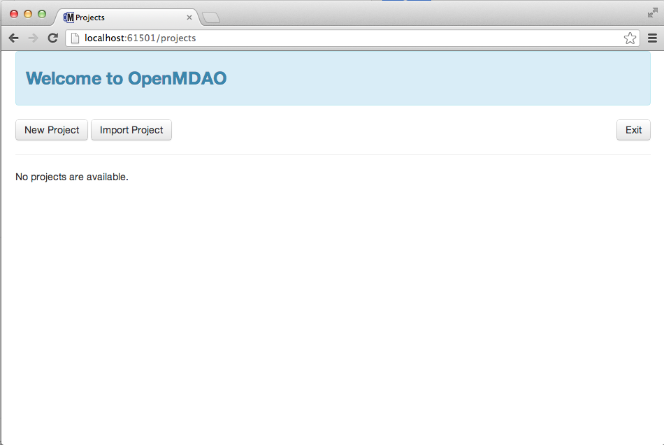
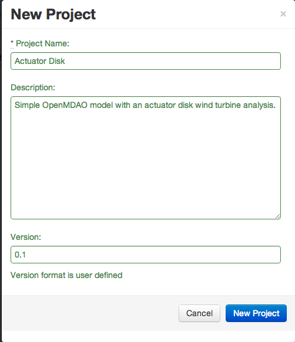
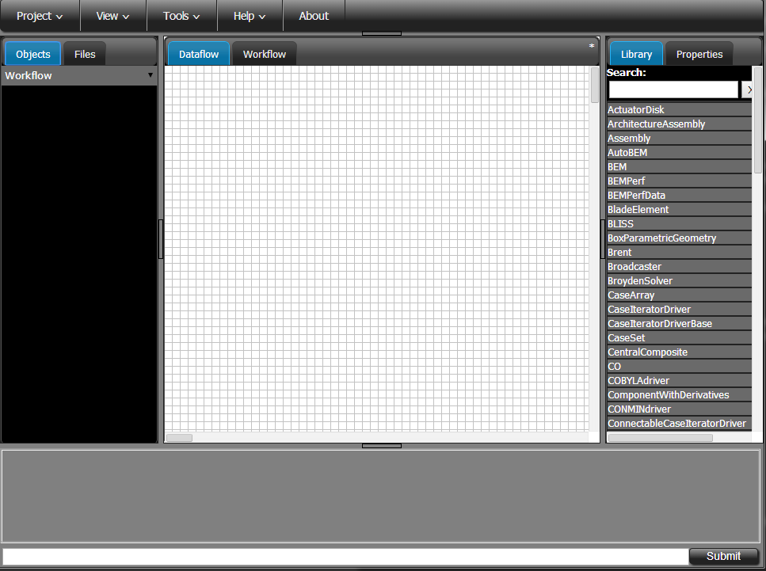
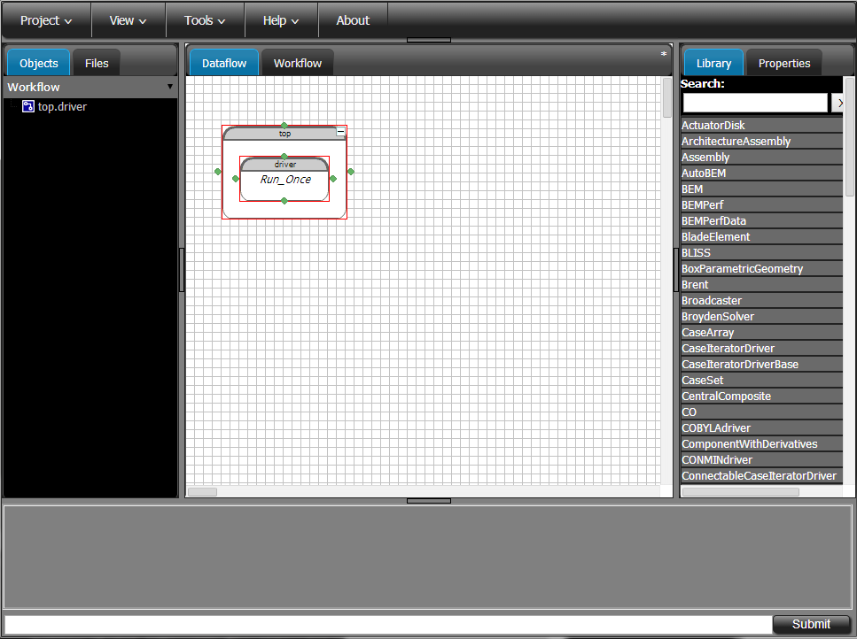

================
Getting Started
================

This plugin contains the documentation and component definitions for the OpenMDAO instructional
class that was given at the  National Renewable Energy Laboratory (NREL) Wind Energy Systems
Engineering workshop. The class was given by Justin Gray and Christopher Heath of the NASA Glenn
Research Center. Justin and Chris are members of the OpenMDAO development team and built the
content of this class to demonstrate the basic usage of OpenMDAO with its GUI on some simple wind
turbine design problems. The class covers:

- Basic usage for creating basic components
- Instantiating those components in the GUI to build simple models
- Building optimizations around models, working with design of experiments
- Recording data from your runs
- Building more complex models

The plugin and this tutorial have been updated for compatibility with OpenMDAO Version 0.9.6.

Browser-Based GUI
========================

The OpenMDAO Graphical User Interface (GUI) is a browser-based application. This means
that the entire GUI is written with HTML5 and Javascript. We call it a browser-based application
and not a "web app" because unlike a web app, the OpenMDAO GUI does not require an active Internet
connection and does not transmit any information across the network. Regardless, the GUI functions
just like a web app in that you interact with it solely through a browser. Also, like many web apps,
the OpenMDAO GUI automatically saves your model as you build it. You never need to manually save
your work.

Opening the GUI
==================

OpenMDAO ships with the GUI. As mentioned, it is written in Javascript and HTML, and even though
our GUI is rendered in a web browser, you don't need to be connected to the Internet to use it.
Since the GUI is built in, once you've installed OpenMDAO, you can just open up a command window,
`activate <http://openmdao.org/docs/getting-started/install.html>`_ your OpenMDAO environment, and
then type:

::

  openmdao gui

Two things should happen next. First, you should see a couple of lines of output to the console that
look similar to the following:

::

  Opening URL in browser: http://localhost:59499 (pid=74061)
  Opened in open
  <<<74061>>> OMG -- Serving on port 59499

The port number after ``http://localhost:`` and the process id after ``pid=`` will be different
every time you open the GUI, so don't worry that your numbers don't match the ones we show here.

Second, the Chrome browser (You did install a recent version of Chrome, right?) will launch to a
page that lists all of the OpenMDAO projects that the GUI knows about. If this is your first time
using the GUI, even if you've been  using OpenMDAO for a while now, there won't be any projects in
the list yet. You have to create new GUI projects for any existing models.

GUI Basics
=============================================================

Start by creating a new project in the OpenMDAO GUI. If you've never used the OpenMDAO GUI before,
you'll be greeted by an empty projects page like this:

.. _`empty-project-page`:

   Initial projects page for the GUI

Start by creating a new project. We'll name it ``actuator_disk``. You don't have to specify any
description or  version information if you don't want to. Only the `Project Name` field is required.

    New project creation dialog

When you first open any new project, you'll see an empty setup.

    Initial OpenMDAO project view

The first thing you will want to do is create an assembly to contain the components that
will define your problem. You do this by dragging 'Assembly' from the Library panel on the
right (it should be near the top of the alphabetical list) and dropping it into the dataflow
grid area.  You will be prompted to give the assembly a name. It is common to name this first
assembly 'top', indicating that is the root of your model's hierarchy, but you can name it
whatever you like.

    Top Assembly

You will notice that your new assembly already contains one Component named 'driver'. The name
`driver` is significant to assemblies. When you tell an assembly to run, it always looks for
`driver` to start the process. The default driver type is 'Run_Once', which just performs
a single execution of each of the components in its workflow (more on that later).

With the GUI open and your top level assembly created, you are now ready to start building a model.
